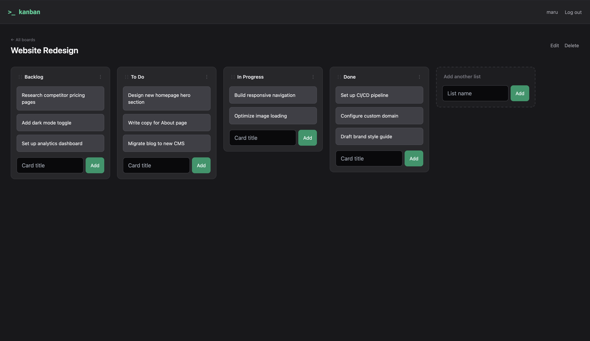

# Kanban Board

A kanban board - I started writing this as a way to get experience with Django before a uni assignment.

## Screenshots



## Features

- User accounts (sign up / log in / log out), boards scoped per-user
- Full CRUD on boards, lists, and cards
- Drag-and-drop: reorder cards within a list, move cards between lists, reorder lists
- Ownership-enforced access control - one user can't view or edit another user's boards via a guessed URL

## Tech Stack

- **Backend:** Django (function-based views), SQLite
- **Frontend:** Django templates, Tailwind CSS (CDN), [SortableJS](https://sortablejs.github.io/Sortable/) for drag-and-drop
- **Testing:** Django's built-in test framework (`django.test.TestCase`)

## Getting Started

```bash
git clone https://github.com/marumakes/django-kanban-board.git
cd django-kanban-board
python3 -m venv venv
source venv/bin/activate
pip install -r requirements.txt
python manage.py migrate
python manage.py createsuperuser   # optional, for /admin/
python manage.py runserver
```

Visit `http://127.0.0.1:8000/` and sign up for an account.

## Running Tests

```bash
python manage.py test
```

## License

Released under the [MIT License](LICENSE).
